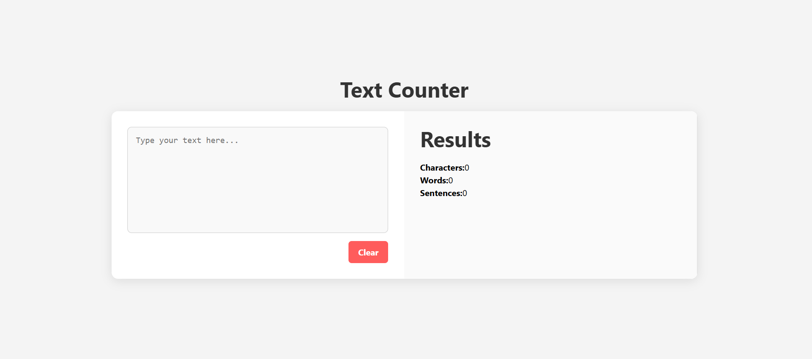
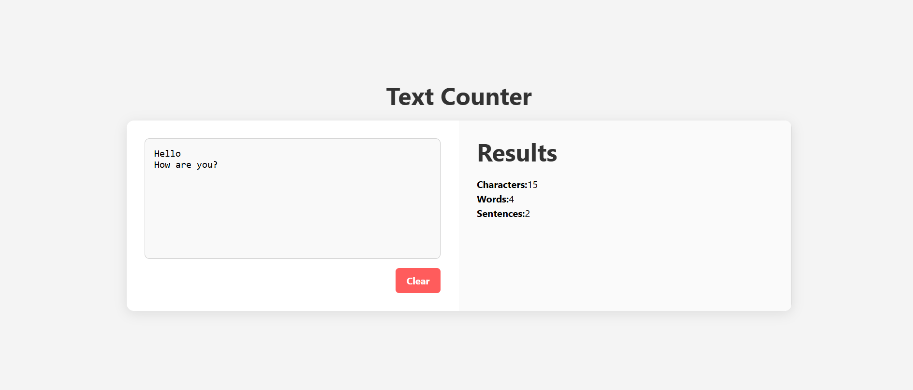

# 📝 Word Counter App (React)

A clean and minimal **Word Counter** web app built using **React.js**.  
It provides real-time word and character count for any text input — perfect for writers, bloggers, and content creators!

---

## ✨ Features

- 🔢 **Live word & character count**
- ⚛️ Built with **React Functional Components**
- 💻 Responsive layout (desktop + mobile)
- 🧠 Lightweight and fast performance
- 🌙 Clean & distraction-free design

---

## 🛠️ Tech Stack

- ⚛️ React.js (with useState)
- 💅 CSS3
- 🌐 Vite 

---

## 📸 Screenshot

  
  
*Replace this with a real screenshot of your app*

---
